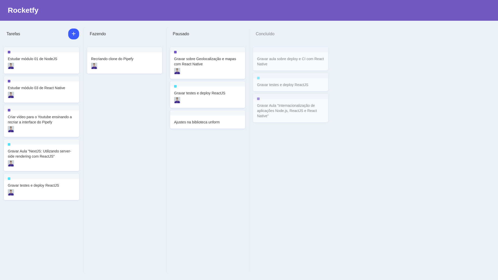

# Pipefy UI Clone

<p align="center">
  
  
</p>
<br>

This project is a Pipefy UI clone developed with [ReactJS](https://reactjs.org/), [Vite](https://vitejs.dev/) and [Typescript](https://www.typescriptlang.org/) to learn more about front end development. 

The main objectives of the project were to learn more about react projects structure, practice development with typescript and develop cards interactions. Were used [styled-components](https://styled-components.com/) to UI development and [React DnD](https://react-dnd.github.io/react-dnd/about) library to implements drag and drop behavior to the cards components. 

<h1 align="center">
    
</h1>

## Technologies
- [ReactJS](https://reactjs.org/)
- [Vite](https://vitejs.dev/)
- [Typescript](https://www.typescriptlang.org/)
- [styled-components](https://styled-components.com/)
- [React DnD](https://react-dnd.github.io/react-dnd/about)

## Getting started
Install the project dependencies:
```shell
$ yarn 
```

Start the project:
```shell
$ yarn dev 
```

## License
This project is licensed under the MIT. Consult the [LICENSE](LICENSE) for more information.
